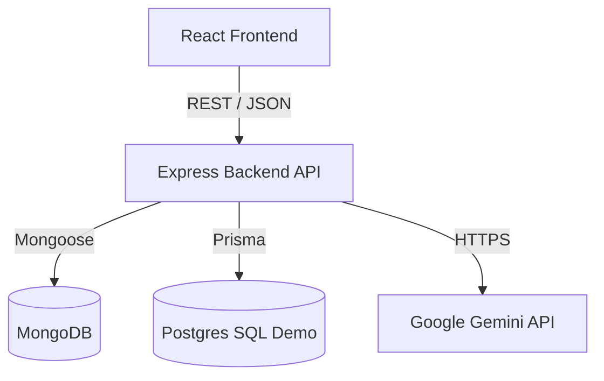

# TimeWise - High Level Design (HLD)

## 1. System Architecture

TimeWise follows a standard 3-tier architecture:
- **Presentation Layer**: React Single Page Application (SPA).
- **Application Layer**: Node.js / Express REST API.
- **Data Layer**: Primary MongoDB (NoSQL) and a secondary analytical Postgres module (SQL).

### Component Diagram

## 2. Key Modules
- **Authentication**: JWT stateless authentication.
- **Task Service**: CRUD and Aggregation pipelines for dashboard metrics.
- **AI Service**: Secure proxy for interacting with LLM for task generation.
- **Analytics Demo**: Relational schema demonstrating JOINs, Grouping, Transactions.

## 3. Data Flow
1. User logs in -> Backend validates password hash -> Returns JWT.
2. User navigates to Dashboard -> Frontend calls `/api/tasks/stats` -> Backend runs Mongo Aggregation -> Returns stats.
3. User uses AI Planner -> Frontend sends prompt -> Backend validates prompt -> Calls Gemini API -> Parses strictly to JSON -> Returns tasks -> Frontend updates state.